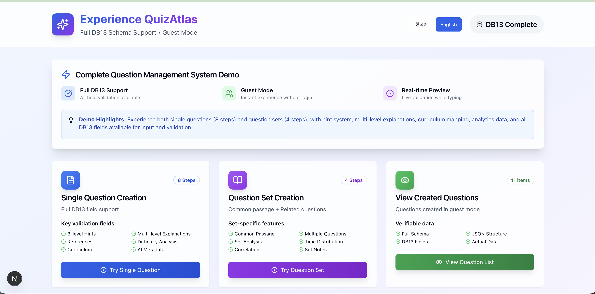

# QuizAtlas Demo Repository

⚠️ **Demo-only repository with DB13 demo subset. The full schema, datasets, prompts, and internal workflows are not public and are available only through partnership discussions.**

This repository demonstrates how Korean CSAT (수능) exam questions can be transformed into structured JSON datasets using the **DB13 demo subset schema**.  
It provides minimal examples and walkthroughs to illustrate the potential of this structured approach for AI training and educational research.

👉 Sample JSON: `/schema/sample_item_set.en.json` (English) / `/schema/sample_item_set.ko.json` (Korean)  
👉 Demo walkthroughs: `/demo/walkthrough.en.md` and `/demo/walkthrough.ko.md`  

[한국어 README 보기 / Read Korean README](./README_KO.md)


*Sample visualization of structured CSAT question data in the DB13 format*

---

## Why Korean CSAT Data?

The Korean CSAT is one of the few large-scale, **publicly released and rigorously verified national exams** worldwide.  
This makes it valuable not only for Korea but also as an international benchmark dataset.

Key qualities of CSAT questions:
- **Precision**: Crafted by Korea Institute for Curriculum and Evaluation (KICE) with multi-stage review
- **Verification**: Public release and official challenge process after every exam
- **Quality**: Developed in one of the world’s most competitive education systems
- **Standardization**: Consistent structure across subjects and years

---

## Repository Structure
```
quizatlas-schema/
├── README.md                    # English readme (this file)
├── README_KO.md                 # Korean readme
├── schema/                      # Schema docs & sample JSON
├── demo/                        # Walkthrough guides
└── docs/                        # FAQ & notices
```

---

## DB13 Schema Highlights

### Single Questions
- Standalone items with rich metadata (difficulty, cognitive level, success rates)
- Multi-step explanations and hints
- Links to curriculum concepts

### Set Questions
- Multi-question groups with a shared passage
- Set-level analytics (time, difficulty progression, completion rate)
- Supports staged difficulty design

### AI-Friendly Features
- Composable subsets for targeted training
- Metadata-rich structure for analysis
- Versioning and extensibility
- Optional authoring notes

---

## Quick Start

### 1. Install dependencies & validate samples
```bash
npm ci                    # Install dependencies (recommended)
npm run validate:all      # Validate all samples
# Optional: validate specific language
npm run validate:en       # English samples only
npm run validate:ko       # Korean samples only
```

### 2. Explore the schema
- **Single questions** → [`/schema/single-question.en.md`](./schema/single-question.en.md)
- **Set questions** → [`/schema/set-question.en.md`](./schema/set-question.en.md)
- **Sample JSONs** → [`/schema/sample_item_set.en.json`](./schema/sample_item_set.en.json)

### 3. Read the walkthrough guide
- **Demo guide** → [`/demo/walkthrough.en.md`](./demo/walkthrough.en.md)

---

## Applications
- **AI Training**: Prepare structured, benchmark-grade data for LLMs
- **Educational Research**: Analyze difficulty, cognition, and pedagogy
- **Assessment Development**: Use as a design template for new items
- **Learning Analytics**: Track performance, success rates, misconceptions
- **Cross-Lingual Benchmarking**: Rare example of open, high-stakes exam data

---

## What's Included (Demo)
- Simplified DB13 demo subset schema docs (single & set items)
- Sample JSON (English & Korean)
- Demo-only schema checker (TypeScript/Zod)
- High-level transformation workflows (no prompts or automation scripts)

## What's Not Included (Security & IP)
- Full schema and extended fields
- Proprietary prompts, model configs, or generation workflows
- Bulk datasets or copyrighted passages
- Any personal or student-level data

---

## Example JSON Snippet
```json
{
  "questionId": "DEMO-2508-KOR-18",
  "questionType": "single",
  "content": {
    "stem": "Which of the following matches the passage?",
    "options": [
      {"id": "①", "text": "A", "isCorrect": false},
      {"id": "②", "text": "B", "isCorrect": true}
    ],
    "correctAnswer": "②"
  },
  "analysis": { "difficulty": "easy", "bloomsLevel": "comprehension" }
}
```

---

## Provenance & Licensing
- Sources are **publicly released** exam materials; this repo only demonstrates transformation structure.
- All original copyrights remain with their owners (e.g., KICE, publishers).
- quizatlas.project@gmail.com for details.


---

## About the Author
I am an **undergraduate student in Elementary Education (English Education track)** with a strong interest in how AI can transform learning and assessment.  

Although I am still a student, I have independently built:  
- **DB13 schema**, a structured format for exam questions with rich metadata.  
- **QuizAtlas**, a demo pipeline that converts Korea’s CSAT (수능) into structured datasets for AI training and educational research.  
- **Item generation workflows** and validation tools for scalable dataset creation.  

My goal is to bridge **educational expertise** and **practical AI applications**, showing how even students can create tools that researchers and companies may find valuable.


---


*This repository is for demo and partnership purposes only. Full datasets are not public.*