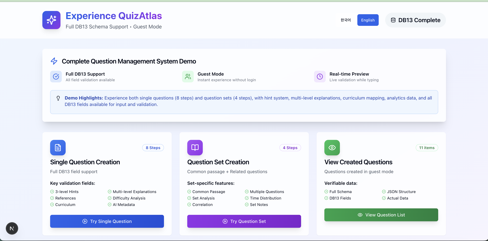

# Demo Walkthrough (English)

## Overview

This document introduces the **conceptual process** of transforming Korean CSAT exam materials into structured JSON using the **DB13 schema**.  
It is a **demo‑only** overview designed to show how data can be organized for AI training, educational research, and learning analytics.

> ⚠️ **Demo Notice**: The full dataset, schema specifications, and internal prompts are not public. Examples here are **abbreviated and anonymized**. Complete specifications can be shared in partnership discussions.

## Transformation Process (High-level)

### 1. Extract Source Material
- **OCR / Text Extraction**: Convert scanned exams or PDFs into text
- **Manual Correction**: Adjust formulas, diagrams, or non-textual elements
- **Quality Control**: Verify accuracy against the original

### 2. Apply DB13 Schema
- **Question Identification**: Assign unique IDs based on exam, subject, type, and number
- **Content Structuring**: Separate stems, options, answers, explanations
- **Core Metadata**: Difficulty, Bloom’s taxonomy level, timing estimates

### 3. Educational Metadata (Optional)
- **Cognitive Classification**: Bloom’s taxonomy (comprehension, application, analysis, evaluation)
- **Curriculum Mapping**: Link to academic standards (when available)
- **Summary Indicators**: Item- or set-level difficulty and progression

### 4. Schema Validation (Demo Example)
```typescript
// Demo-only example
interface Question {
  questionId: string;
  questionType: 'single' | 'set';
  content: QuestionContent;
  analysis?: QuestionAnalysis;
}
```
> In practice, TypeScript or Zod validators can be used to enforce type safety.

### 5. Applications
- **AI Training**: Structured supervision signals for fine-tuning  
- **Educational Analytics**: Rich metadata for learning outcome studies  
- **Assessment Development**: Reusable templates for new questions  
- **Research**: Benchmark datasets for reasoning and comprehension tasks

## Conceptual Example

**Input**: Reading passage + several linked questions  
**Output**: JSON object (demo‑simplified) with:

- Shared passage linked to individual questions  
- Brief explanations and optional hints  
- Metadata such as difficulty, time estimates, Bloom's level  
- Compatible structure for AI/ML use (single + set questions)

> Note: Real datasets include richer fields (e.g., multi‑population success rates). These are **intentionally omitted** from the demo.

### Interactive Demo Interface

The following screenshots show the actual QuizAtlas demo interface:


*Figure 1: QuizAtlas demo interface showing the complete question management system with single question creation (8 steps), question set creation (4 steps), and question viewing features. The interface demonstrates full DB13 schema support, guest mode functionality, and real-time validation.*

## Key Benefits

### For Educators
- **Teaching Insights**: Notes on misconceptions and design intent  
- **Curriculum Alignment**: Supports mapping to achievement standards  
- **Reusable Templates**: Accelerates assessment design

### For Researchers
- **Standardized Format**: Enables statistical and comparative studies  
- **Performance Tracking**: Difficulty and cognitive progression  
- **Cross‑lingual Potential**: Schema can apply to SAT, GRE, A‑levels, Gaokao

### For AI Development
- **Training Data**: High‑quality, structured educational tasks  
- **Evaluation Benchmarks**: Standardized test items for model assessment  
- **Reasoning Evaluation**: Multi‑step comprehension and application tasks

## Demo Files

- **Schema Docs (simplified)**: `/schema/single-question.md`, `/schema/set-question.md`  
- **Sample JSON**: `/schema/sample_item_set.json`  
- **Full Specifications**: Provided upon request (partnership basis)

## Technical Specs (Demo)

- **Format**: JSON (core fields only)  
- **Schema Version**: DB13 (demo subset)  
- **Encoding**: UTF‑8 (full Korean text supported)  
- **Validation**: TypeScript/Zod examples available if needed  
- **Scalability**: Designed for database + search integration

## Next Steps

1. **Review Schema**: See simplified schema documents  
2. **Check Sample**: Load `sample_item_set.json` in a JSON viewer  
3. **Plan Integration**: Explore compatibility with your systems  
4. **Partnership Inquiry**: Contact us for access to full specs and datasets