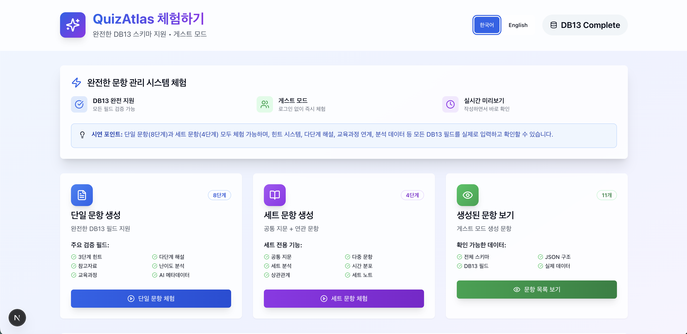

# 데모 설명 (한국어)

## 개요

이 문서는 한국 수능 문항을 **DB13 스키마**로 구조화된 JSON으로 변환하는 **개념적 흐름**을 소개하는 데모입니다. 

> ⚠️ **데모 전용 안내**: 전체 데이터셋/전체 스키마/프롬프트/내부 코드는 공개하지 않습니다. 본 문서의 예시는 축약·익명화된 형태이며, 세부 명세는 파트너십 논의 시 제공됩니다.

## 변환 과정 (High-level)

### 1. 원본 자료 추출
- **OCR/텍스트 추출**: 스캔본 또는 PDF에서 텍스트 추출
- **수작업 보정**: 수식·도표 등 자동 인식이 어려운 영역 보완
- **품질 관리**: 원본과 대조하여 정확성 점검

### 2. DB13 스키마 적용
- **문항 식별**: 규칙 기반의 고유 ID 부여(예: 시험/과목/유형/번호 조합)
- **내용 구조화**: 문제, 선택지, 정답 등 핵심 필드 정리
- **핵심 메타데이터**: 난이도, 인지 수준, 시간 추정 등(데모에는 일부만 포함)

### 3. 교육적 메타데이터 확장(선택)
- **인지 분류**: 인지 수준 라벨링
- **교육과정 정렬**: 성취기준·단원 등과의 매핑(가능 시)
- **성과 지표**: 항목·세트 단위의 요약 지표(데모에는 상세 통계 미포함)

### 4. TypeScript 기반 구조 검토(예시)
```typescript
// Demo-only example (핵심 구조 확인용)
interface Question {
  questionId: string;
  questionType: 'single' | 'set';
  content: QuestionContent;
  analysis?: QuestionAnalysis;
}
```
> 필요 시 데모용 타입 검사(예: TypeScript/Zod) 스니펫을 제공할 수 있습니다.

### 5. 다양한 활용 준비
- **AI 학습/평가**: 구조화된 감독 신호, 평가 벤치마크 설계
- **교육 분석**: 학습/평가 연구를 위한 메타데이터 활용
- **평가 개발**: 신규 문항 설계 시 템플릿·품질 점검에 활용

## 변환 예시(개념)

**입력**: 독서 지문 + 복수 문항(스캔 또는 원문 텍스트)

**출력**: 다수의 구조화 필드를 갖춘 JSON 객체(데모 축약본)
- 공통 지문(stimulus)과 연결된 개별 문항들
- 간단한 해설·힌트 등 학습 보조 필드(선택)
- 교육적 메타데이터(난이도/인지 수준/시간 등)
- AI 학습에 친화적인 데이터 구성(세트/단일 호환)

> 주의: 실제 서비스용 데이터에는 더 풍부한 필드와 통계가 포함될 수 있으나, 데모에는 상세 지표(모집단 정답률 등)를 의도적으로 포함하지 않습니다.

### 데모 인터페이스

실제 QuizAtlas 데모 인터페이스 화면입니다:


*그림 1: QuizAtlas 데모 인터페이스 - 단일 문제 생성(8단계), 문제 세트 생성(4단계), 문제 보기 기능을 포함한 완전한 문제 관리 시스템. DB13 스키마 완전 지원, 게스트 모드, 실시간 유효성 검사 기능을 보여줍니다.*

## 데모 파일들

- **스키마 문서(축약본)**: `/schema/single-question.md`, `/schema/set-question.md`
- **샘플 JSON(최소 예시)**: `/schema/sample_item_set.json`
- **전체 명세**: 파트너십 논의 시 제공(요청 기반)

## 기술 사양(데모 기준)

- **형식**: JSON (핵심 필드 중심의 구조 검증)
- **스키마 버전**: DB13 (데모용 축약본)
- **문자 인코딩**: UTF-8 (한국어 완전 지원)
- **검증**: 타입 안전성 확인용 예시(필요 시 제공)
- **확장성**: DB/검색 시스템과의 통합을 염두에 둔 설계

## 다음 단계

1. **스키마 탐색**: 축약 스키마 문서 확인
2. **샘플 확인**: JSON 뷰어에서 `sample_item_set.json` 열기
3. **적용 검토**: 귀하의 시스템/연구에 적합한 통합 방식 설계
4. **파트너십 문의**: 전체 명세·확장 데이터·워크플로우 검토 요청

## 한국 수능 데이터의 가치(요약)

### 높은 품질
- **정밀한 설계**: 한국교육과정평가원(KICE)의 체계적 출제
- **검증성**: 공개·이의제기 절차를 통한 품질 검토
- **표준성**: 다년·다과목에 걸친 일관된 형식

### 국제적 활용 가능성
- **언어 독립적 스키마**: SAT/GRE/A-levels/Gaokao 등에도 적용 가능
- **연구 가치**: 교육·언어처리·학습심리 등 다양한 분야에 유용
- **AI 연구**: 교차언어 학습/평가 벤치마크의 희소 사례

---

*본 문서는 데모·협력 논의 목적이며, 전체 데이터셋과 상세 명세는 공개되어 있지 않습니다. 자세한 내용은 `NOTICE.md`/`NOTICE.ko.md`를 참고해 주세요.*